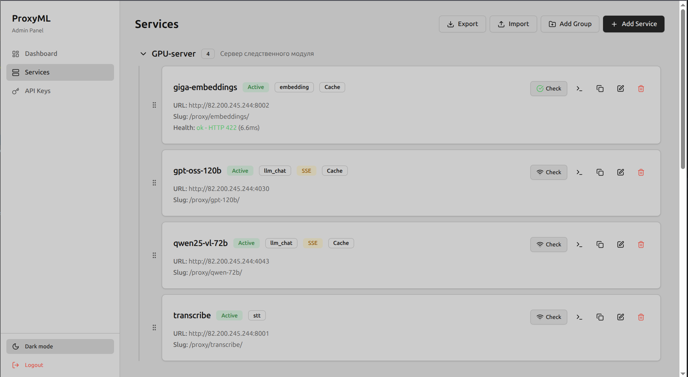

# ProxyML

Прокси-сервис для ML-моделей (LLM, эмбеддеры, STT, TTS и др.) с админ-панелью, управлением API-ключами и аналитикой запросов.

ProxyML принимает запросы от клиентов, авторизует их по API-ключу и прозрачно проксирует к целевым бэкендам — vLLM, OpenAI-совместимым серверам, эмбеддерам, speech-to-text и любым другим HTTP-сервисам. Поддерживает стриминг (SSE), кеширование ответов в Redis и детальную статистику по каждому запросу.



---

## Возможности

- **Универсальный прокси** — поддержка любых HTTP-сервисов, не только LLM. Добавление нового сервиса через админку без изменения кода
- **Стриминг (SSE)** — прозрачная передача Server-Sent Events от бэкенда к клиенту
- **Кеширование в Redis** — опциональное кеширование успешных нестриминговых ответов с настраиваемым TTL для каждого сервиса
- **API-ключи с разграничением доступа** — каждый ключ может быть ограничен по списку сервисов, rate-limit (RPM), сроку действия
- **Группы сервисов** — организация сервисов по группам с drag-and-drop перемещением
- **Админ-панель** — React-приложение с dark/light темой, встроенное в бэкенд (один Docker-образ)
- **Проверка соединения** — health-check бэкендов прямо из админки
- **Аналитика** — дашборд с графиками, фильтрацией по сервису, методу, статусу, API-ключу
- **Импорт/экспорт** — полное резервное копирование конфигурации сервисов и групп в JSON
- **Клонирование сервисов** — быстрое создание копии существующего сервиса
- **cURL-генератор** — готовые команды для тестирования каждого сервиса

---

## Стек технологий

| Компонент | Технологии |
|-----------|-----------|
| Backend | Python 3.12, FastAPI, uvicorn |
| ORM / БД | SQLAlchemy (async), asyncpg, PostgreSQL 16, Alembic |
| Кеш | Redis 7 |
| Прокси-клиент | httpx (async, HTTP/2, streaming) |
| Frontend | React 19, TypeScript, Vite, Tailwind CSS, shadcn/ui, Zustand |
| Авторизация | JWT (админка), API-ключи X-Api-Key (публичный API) |
| Deploy | Docker, Docker Compose |

---

## Быстрый старт

### Требования

- Docker и Docker Compose
- (Опционально) Python 3.12+, Node.js 20+ — для локальной разработки

### Запуск через Docker Compose

```bash
cp .env.example .env   # При необходимости отредактируйте .env
docker-compose up -d
```

Приложение будет доступно на `http://localhost:8000`.

### Учётные данные по умолчанию

| Параметр | Значение |
|----------|----------|
| Логин | `admin` |
| Пароль | `adata_admin_zxcv1234` |

> Пароль и логин задаются через переменные окружения `ADMIN_USERNAME` / `ADMIN_PASSWORD`.

---

## Конфигурация

Все настройки задаются через переменные окружения или файл `.env`:

| Переменная | По умолчанию | Описание |
|------------|-------------|----------|
| `DB_HOST` | `localhost` | Хост PostgreSQL |
| `DB_PORT` | `5432` | Порт PostgreSQL |
| `DB_DATABASE` | `proxyml` | Имя базы данных |
| `DB_USERNAME` | `proxyml` | Пользователь БД |
| `DB_PASSWORD` | `proxyml` | Пароль БД |
| `SECRET_KEY` | `change-me-in-production` | Секретный ключ для подписи JWT |
| `JWT_ALGORITHM` | `HS256` | Алгоритм JWT |
| `JWT_EXPIRE_MINUTES` | `1440` | Время жизни JWT-токена (минуты) |
| `ADMIN_USERNAME` | `admin` | Логин администратора |
| `ADMIN_PASSWORD` | `adata_admin_zxcv1234` | Пароль администратора |
| `REDIS_HOST` | `127.0.0.1` | Хост Redis |
| `REDIS_PORT` | `6379` | Порт Redis |
| `REDIS_DB` | `0` | Номер базы Redis |
| `CACHE_TTL_SECONDS` | `86400` | TTL кеша по умолчанию (секунды) |

---

## API

### Прокси

```
ANY /proxy/{slug}/{path}
```

Проксирует запрос к бэкенду сервиса с указанным `slug`. Требует заголовок `X-Api-Key`.

**Пример запроса:**

```bash
curl -X POST 'http://localhost:8000/proxy/my-llm/v1/chat/completions' \
  -H 'Content-Type: application/json' \
  -H 'X-Api-Key: pml_ваш_ключ' \
  -d '{
  "model": "gpt-4",
  "messages": [{"role": "user", "content": "Привет!"}],
  "max_tokens": 100
}'
```

### Каталог сервисов

```
GET /api/services          # Список активных сервисов
GET /api/services/{slug}   # Детали сервиса
GET /api/health            # Health-check приложения
```

### Админ API (JWT)

| Метод | Путь | Описание |
|-------|------|----------|
| POST | `/api/admin/auth/login` | Авторизация, получение JWT |
| GET | `/api/admin/services` | Список всех сервисов |
| POST | `/api/admin/services` | Создать сервис |
| PUT | `/api/admin/services/{id}` | Обновить сервис |
| DELETE | `/api/admin/services/{id}` | Удалить сервис |
| POST | `/api/admin/services/{id}/check` | Проверить соединение |
| GET | `/api/admin/services-export` | Экспорт конфигурации |
| POST | `/api/admin/services-import` | Импорт конфигурации |
| GET | `/api/admin/service-groups` | Список групп |
| POST/PUT/DELETE | `/api/admin/service-groups[/{id}]` | CRUD групп |
| GET | `/api/admin/api-keys` | Список API-ключей |
| POST | `/api/admin/api-keys` | Создать ключ |
| PUT | `/api/admin/api-keys/{id}` | Обновить ключ |
| DELETE | `/api/admin/api-keys/{id}` | Удалить ключ |
| PATCH | `/api/admin/api-keys/{id}/toggle` | Вкл/выкл ключ |
| GET | `/api/admin/api-keys/by-service/{slug}` | Ключи с доступом к сервису |
| GET | `/api/admin/stats/overview` | Общая статистика |
| GET | `/api/admin/stats/by-service` | Статистика по сервисам |
| GET | `/api/admin/stats/by-key` | Статистика по ключам |
| GET | `/api/admin/stats/recent` | Последние запросы с фильтрами |

---

## Разработка

### Локальный запуск бэкенда

```bash
# Установка зависимостей
pip install -e ".[dev]"

# Запуск PostgreSQL и Redis (через Docker)
docker-compose up -d db redis

# Применение миграций
alembic upgrade head

# Запуск сервера в режиме разработки
uvicorn src.main:app --reload --host 0.0.0.0 --port 8000
```

### Локальный запуск фронтенда

```bash
cd admin-ui
npm install
npm run dev    # http://localhost:5173
```

### Makefile

```bash
make up        # docker-compose up -d
make down      # docker-compose down
make migrate   # alembic upgrade head
make dev       # uvicorn с hot-reload
make install   # pip install -e ".[dev]"
make lint      # ruff check
make test      # pytest
```

### Создание миграции

```bash
alembic revision --autogenerate -m "описание изменений"
alembic upgrade head
```

---

## Деплой в Kubernetes

Проект собирается в **один Docker-образ** (фронтенд + бэкенд):

```bash
docker build -t proxyml:latest .
docker tag proxyml:latest your-registry.com/proxyml:latest
docker push your-registry.com/proxyml:latest
```

При старте контейнер автоматически:
1. Применяет миграции БД (`alembic upgrade head`)
2. Создаёт/обновляет учётную запись администратора
3. Запускает uvicorn на порту `8000`

**Зависимости:** PostgreSQL 16, Redis 7. Настройки передаются через переменные окружения (ConfigMap / Secret).

---

## Структура проекта

```
ProxyML/
├── src/
│   ├── main.py                 # FastAPI-приложение, lifespan, SPA-раздача
│   ├── config.py               # Pydantic Settings
│   ├── db/                     # Engine, session, base model
│   ├── models/                 # ORM-модели (Service, ApiKey, AdminUser, RequestLog, ServiceGroup)
│   ├── schemas/                # Pydantic-схемы для API
│   ├── services/               # Бизнес-логика (CRUD, auth, health-check, логирование)
│   ├── proxy/                  # Ядро прокси (handler, streaming, auth-стратегии, httpx-клиент)
│   ├── cache/                  # Redis-клиент и кеширование ответов
│   ├── api/
│   │   ├── v1/                 # Публичный API (каталог, health)
│   │   └── admin/              # Админ API (CRUD, статистика, импорт/экспорт)
│   ├── middleware/             # ASGI-мидлвари (логирование запросов)
│   └── utils/                  # Криптография, логирование
├── admin-ui/                   # React-фронтенд
├── alembic/                    # Миграции БД
├── Dockerfile                  # Multi-stage сборка (Node.js + Python)
├── docker-compose.yml          # PostgreSQL + Redis + приложение
├── Makefile
├── pyproject.toml
└── .env.example
```
